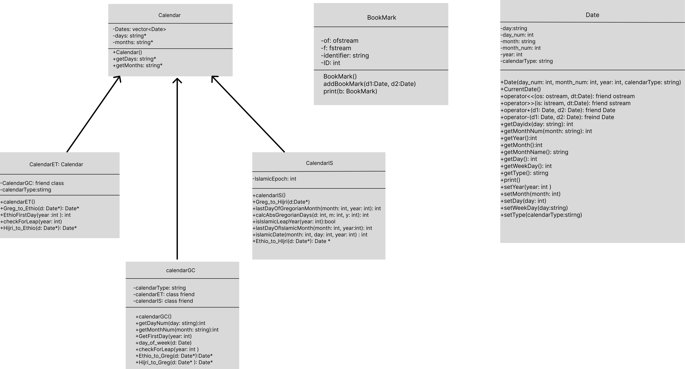

# Report

# Introduction
Calendar systems are essential tools for organizing and keeping track of time. Different cultures and countries have developed their own calendar systems based on solar or lunar cycles. While the Gregorian calendar is the internationally accepted civil calendar, understanding other calendar systems such as the Ethiopian and Hijri calendars is just as important. These calendars are used as civil and ecclesiastical calendars in Ethiopia, Eritrea, and for determining Islamic holidays and rituals.

In a globalized world, the need for converting dates between different calendar systems is paramount. Converting dates can be challenging, especially for individuals who work across different cultures and need to schedule appointments and events with people from different parts of the world. Hence, there is a need for a user-friendly program that allows for the conversion of dates between different calendar systems.

# Approach
The project aimed to design and develop a program that would enable users to convert dates between the Gregorian, Ethiopian, and Hijri calendar systems. Additionally, the program would allow users to add and subtract dates in each calendar system and bookmark converted dates for future reference.

To achieve this, the project utilized object-oriented programming principles, creating a date class and a calendar class that defined the general structure of the derived calendar classes, including the Gregorian, Ethiopian, and Hijri calendars. The project utilized polymorphism, inheritance, and friendship concepts to access the month and day data values of the calendar class, ensuring efficient data management.

To create accurate conversion functions, the project implemented Zeller's congruence formula and other conversion algorithms found online. Additionally, C++ time libraries were used to get the current time, and string stream libraries were used to convert the time output to a stream, enabling the getline function to be applied to it. The program included features for bookmarking converted dates, and these bookmarks were saved in a .txt file. To enhance the user experience, some color and atmosphere were added to the interface using bash commands.

To optimize the program's speed and memory, the project employed various techniques such as inline functions, reference operators, pointers, and vectors. Furthermore, exception handling was implemented to guide the user in inputting correct values, but the program might crash if the user inputs an incorrect month (such as a negative number). Although the program gives accurate results in most instances, it may sometimes have an error of a day during conversion due to the limitations of the algorithms used. Thus, enhancing the efficiency of the conversion algorithms could be an area for further improvement.

# Potential Applications:

The date conversion program has potential applications in real-world scenarios, including scheduling, event planning, and historical research. For example, event planners could use it to schedule meetings across different time zones, while historians could use it to convert historical dates between different calendar systems accurately. The program is an essential tool that can significantly impact various industries, and improving its accuracy and efficiency can only make it more useful.

# Solution
  #  Classes
Date Class:
The date class is an essential component of the calendar class, used to create and manipulate date objects. These objects are created with four primary attributes: day, month, year, and the calendar system they belong to. The day and month names are determined automatically using Zeller’s congruence algorithm, which is a widely used method for calculating the day of the week for any given date. This algorithm takes into account the day, month, and year of the date in question and uses a series of mathematical calculations to determine the corresponding day of the week. Once a date object has been instantiated, it can be used in conjunction with the calendar class to perform a variety of date-related operations.

Calendar class:
This class is created with a vector of dates, a pointer to days array, and a pointer to months array as attributes. This class also prints the calendar in a tabulated format with the current date colored red.

Calendar GC:
The calendarGC class is designed to initialize the Gregorian calendar object. It sets the calendarType variable to "Gregorian" and defines an array gregorianMonths containing the number of days in each month of the Gregorian calendar. The constructor initializes a Date variable to the current Gregorian date and calls the checkForLeap function to check if it's a leap year. It then creates two string arrays days and months with the names of days and months respectively. The constructor calculates the first day of the current month using the day_of_week function and adds Date objects to the Dates vector to represent the current month. There are also several other functions defined in the class to convert between different calendar systems.

Calendar ET:
The calendarET class which inherits from a base class Calendar is designed to initialize the Ethiopian calendar object. The calendarET class provides functions to convert Gregorian calendar dates to Ethiopian calendar dates and to check for leap years in the Ethiopian calendar. It also includes a private variable ethipianMonthdays which stores the number of days in each month of the Ethiopian calendar and private variables days and months which store the names of the days and months in the Ethiopian calendar, respectively. The class also has a function to convert Hijri calendar dates to Ethiopian calendar dates by first converting to the Gregorian calendar.

CalendarIS:
The "calendarIS" class extends the calendar class to initialize the Hijri calendar object. It includes functions to convert dates from the Gregorian calendar to the Hijri calendar, calculate the last day of a month on both calendars, and check if a year is a leap year on the Hijri calendar. The program also includes a function to convert dates from the Ethiopian calendar to the Hijri calendar.

Bookmark:
This code represents a bookmark for converting dates. It has a private member identifier that holds the name of the file where the bookmarks are stored, and static member ID that is incremented every time a new bookmark is added. The class has a default constructor that opens the file for appending and for reading. It also has a public method addBookMark that takes two Date objects as arguments and adds the bookmark to the file. The addBookMark method prompts the user to enter the type of date conversion and writes the bookmark information to the file in a specific format.

Functions:
The AdderSubtractor() function prompts the user to choose between adding or subtracting days, months, and years from a start date. It then takes the input of the start date and the interval to be added/subtracted, performs the operation and displays the resulting date.

The conversionPrompt() function prompts the user to choose between six options for date conversion. After the user chooses an option, the function takes input of a date in Gregorian format and converts it to one of the other calendar systems. The converted date is then displayed.

The UserInput() function is an inline function that prompts the user to enter a date in numbers and takes the input as a reference to a Date object.

The Greeting() function displays a greeting message with information about the program's two functionalities, prompting the user to select one of the options. If the user selects option 1, the function calls the AdderSubtractor() function, and if the user selects option 2, the function calls the conversionPrompt() function.

The BookmarkPrompt() function prompts the user to decide whether to bookmark a particular date and stores the bookmark in a BookMark object.

The restart() function prompts the user to decide whether to restart the program or not. If the user chooses to restart, the function sets the input string to "Y", and the program continues. If the user chooses not to restart, the function exits the program.

The main function creates an infinite loop which in which the program will run. The Greeting()  and restart() functions are called from the loop and the loop will break when the user decides to exit the program through the restart() function.

# UML diagram


# Implementation of Object-Oriented paradigms

C++ Standard Template Library (STL):
This program utilizes the Standard Template Library as one of the object-Oriented Programming
paradigms. One of the STL used in the program is the vector STL that allows the program to use
the user data structure of types of Vector to store the objects of dates.

```c++
protected:
      vector<Date> Dates;
for ( int i = 0; i< gregorianMonths[d.getMonth()+1]+firstDay; i++){
        d.setDay((i>=firstDay) ? (i-firstDay)+1 : 0);
        Dates.push_back(d);
      }
```

Inheritance:
The program utilizes the concept of Inheritance to allow some classes to inherit data variables
and functions of another class.The classes “calendarGC”, “calendatET”, and “calendarIS” inherit from “calendar.”

```
class calendarGC:public Calendar {
  private:
    string calendarType = "Gregorian";

```
```
class calendarIS: public Calendar {
private:
    const int IslamicEpoch = 227014;

```
```
class calendarET: public Calendar {
  private:
    friend class calendarGC;

```
Exception Handling:
This program utilizes the exception handling concept. Exception handling is essential in
encountering errors that the program did not anticipate. In the program, exception handling was
used to detect when the user is asked to enter their age. The program asks the user to inout their choice as integer between 1 and 6 and if they input an invalid value exception is thrown.
```
try {
  switch (choice)
  {
  case 1:
    UserInput(d);
    d_conv=EC.Greg_to_Ethio(&d);
    cout<<"Your converted date is: "<<*d_conv;
    break;
  case 2:
    UserInput(d);
    d_conv=IC.Greg_to_Hijri(&d);
    cout<<"Your converted date is: "<<*d_conv;
    break;
  case 3:
    UserInput(d);
    d_conv=GC.Hijri_to_Greg(&d);
    cout<<"Your converted date is: "<<*d_conv;
    break;
  case 4:
    UserInput(d);
    d_conv=GC.Ethio_to_Greg(&d);
    cout<<"Your converted date is: "<<*d_conv;
    break;
  case 5:
    UserInput(d);
    d_conv=IC.Ethio_to_Hijri(&d);
    cout<<"Your converted date is: "<<*d_conv;
    break;
  case 6:
    UserInput(d);
    d_conv=EC.Hijri_to_Ethio(&d);
    cout<<"Your converted date is: "<<*d_conv;
    break;
  case 7:
    B.viewBookmarkedDates();
    break;
  default:
    throw("");
    break;
  }
  break;
  }
  catch(...) {
    cout<<"\033[91mIncorrect input.\033[0m\n";
    cout<<"\033[92m Input 1/2/3/4/5/6 >> \033[0m";
    cin>> choice;
  } 
  }

```
Friendship and operator overloading:
A friend function can access private and protected members of other classes in which it is declared as a friend. I have overloaded different operators and declared them as friend functions of the date class. This will allow the overloaded operators to have access to the private members of the Date class they operate in.
```
friend ostream& operator<<(ostream& os, const Date& dt);
friend istream& operator>>(istream& is, Date& d);
friend Date operator+(const Date& d1, const Date& d2);
friend Date operator-(const Date& d1, const Date& d2);
```
```
ostream& operator <<(ostream& os, const Date& dt) {
        os <<dt.day<<", "<<dt.month<< " "<<dt.day_num<<", "<<dt.year
        <<" ("<<to_string(dt.day_num)+"/"+to_string(dt.month_num) + "/"+ to_string(dt.year)<<")"<<endl;
        return os;
    }
istream& operator>>(istream& is, Date& d) {
    int day, month, year;
    cout << "Enter day: ";
    is >> day;
    cout << "Enter month: ";
    is >> month;
    cout << "Enter year: ";
    is >> year;
    
    d = Date(day, month, year);
    return is;
}
```
Implementation of optimizations
Dynamic memory allocation:
The program utilizes dynamic memory allocation to optimize the memory storage of the
Program. Dynamic memory allocation is  used in different parts of the program one example is when dynamically creating arrays to store days and months in different calendar systems.

```
class Calendar {
    protected:
      vector<Date> Dates;
      string *days;
      string *months;
```
```
calendarIS() {
      days = new string[7]{"ٱلْأَحَد(S)", "الاِثْنَيْن (M)","ٱلثُّلَاثَاء (T)", "ٱلْأَرْبِعَاء (W)", "ٱلْخَمِيس (Th)","ٱلْجُمْعَة (F)","ٱلسَّبْت (Sa)"};
      months = new string[12]{"ٱلْمُحَرَّم","صَفَر","رَبِيع ٱلْأَوَّل","رَبِيع ٱلْآخِر","جُمَادَىٰ ٱلْأُولَىٰ","جُمَادَىٰ ٱلْآخِرَة","رَجَب","شَعْبَان","رَمَضَان","شَوَّال","ذُو ٱلْقَعْدَة","ذُو ٱلْحِجَّة"};
```
Inline functions:
The program uses the inline functions to optimize the speed of the program during execution.
The inline function is used to propt for user input.
```
inline void UserInput(Date& d){
  cout<<"Please enter the date in numbers only."<<endl;
  cin>>d;
}
```
Pointers to objects:
The program uses functions that pass by reference to optimize the memory and speed of code
Execution. When date objects are passed throughout the program they are passed by reference.
One example is the following;

```
case 1:
    UserInput(d);
    d_conv=EC.Greg_to_Ethio(&d);
    cout<<"Your converted date is: "<<*d_conv;
    break;
```
# Bibliography
“The History of the Calendar.” Calendar, 6 Feb. 2023, https://www.calendar.com/history-of-the-calendar/. 
Maunder, Chris. “How to Change Text Color in a Linux Terminal.” CodeProject, CodeProject, 7 Apr. 2022, https://www.codeproject.com/Articles/5329247/How-to-change-text-color-in-a-Linux-terminal. 
“Convert Gregorian to Hijri Date in Javascript.” Gist, https://gist.github.com/irfanbaigse/41b0f5054dcc50e62b5da6e5b4be9e37. 
Zenysis. “Zenysis/Ethiopian-Date: Ethiopian-Date Is a Date Converter from Ethiopian Calendar to Gregorian Calendar and Vice-Versa.” GitHub, https://github.com/Zenysis/ethiopian-date. 
“C++ programming language,” GeeksforGeeks. [Online]. Available:
https://www.geeksforgeeks.org/c-plus-plus/?ref=shm.
